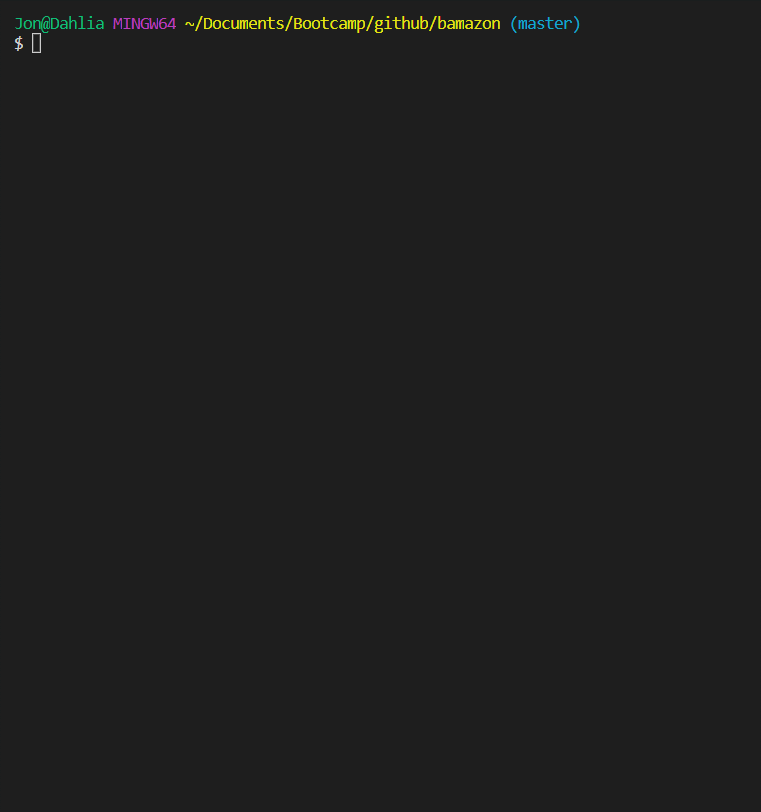

# bamazon

This is a node.js application which interacts with a MySQL database to emulate a storefront.  
A few brief example interactions can be found below (in animated gif form).  

In this example, the user buys apples in three separate transactions, bankrupting the vendor. 
